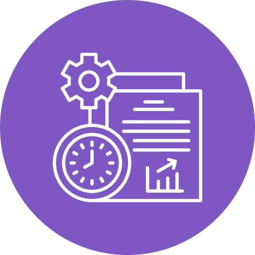
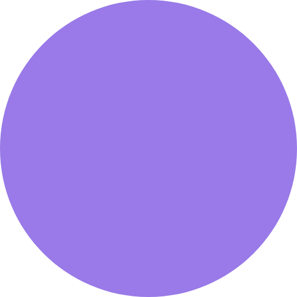
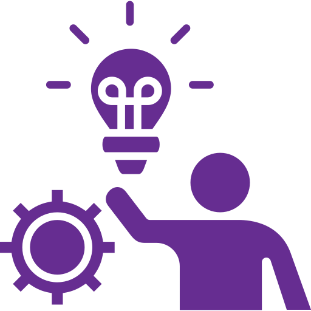

  

--- 

  

   About Me
--- 

I am a dedicated <strong>Information Systems student</strong> with a strong passion for <strong>UI/UX design</strong>, <strong>cybersecurity</strong>, and <strong>data analysis</strong>. Skilled in creating user-centered designs, developing intuitive interfaces, and understanding the importance of securing digital environments. I constantly explore new technologies and best practices to enhance both user experience and system security while diving into the world of data analysis.

 Contact
---

  <strong>Let’s connect ! Always excited to share ideas, team up, or talk about awesome tech stuff.</strong>

  
  
  
  

---

 Education
---

<strong>Bachelor's Degree in Information Systems</strong> 
<strong>Al-Maarefa University</strong> (2022 - 2026) 
4 Years (Level 7 | 8)

  

  

---

 Projects
---

  
  <strong style="font-size: 30px; vertical-align: middle;">Miniature Banking System</strong>

- Developed a simple banking system using **SQL** to efficiently manage customer accounts, transactions, and balances.  
- Enabled accurate and fast data processing, demonstrating understanding of relational databases and real-world financial systems.

  
  <strong style="font-size: 30px; vertical-align: middle;">Course Deletion and Update Module</strong>

- Designed administrative tools for course data management using **Java**.  
- Improved the user experience for administrators by streamlining in-memory course management tasks.

  
  <strong style="font-size: 30px; vertical-align: middle;">Airline Booking App (Figma & UI Design)</strong>

- Designed a professional airline booking app using **Figma**, focusing on **UI design**.  
- Incorporated attractive graphic elements and smooth transitions to reflect professionalism.

---

 Programming Skills
---

  I enjoy exploring different programming languages and tools to build intuitive interfaces, automate tasks, and analyze data efficiently. Always learning and experimenting with new technologies to improve my skills.

  

 
   
   
   
   
   
   
   

---
<h2>💡 Business & Management Skills</h2>

<ul>
  <li>E-commerce</li>
  <li>Finance</li>
  <li>Business Administration</li>
  <li>Data Analysis</li>
</ul>

  

---

Proudly collaborating with these amazing companies and enjoying every moment of our journey together !

  
  
  

---

  

